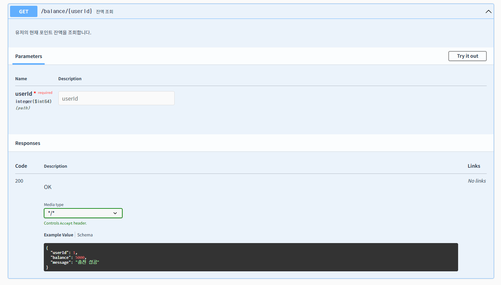
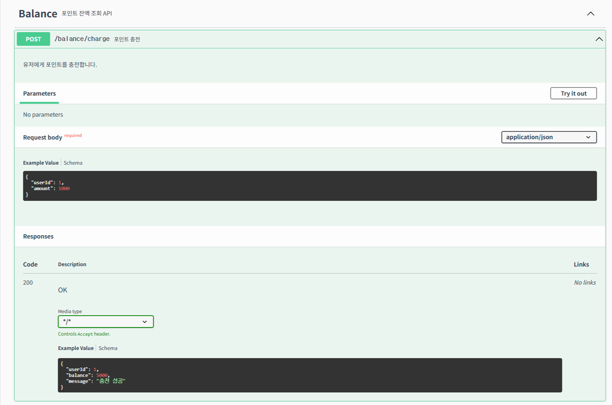
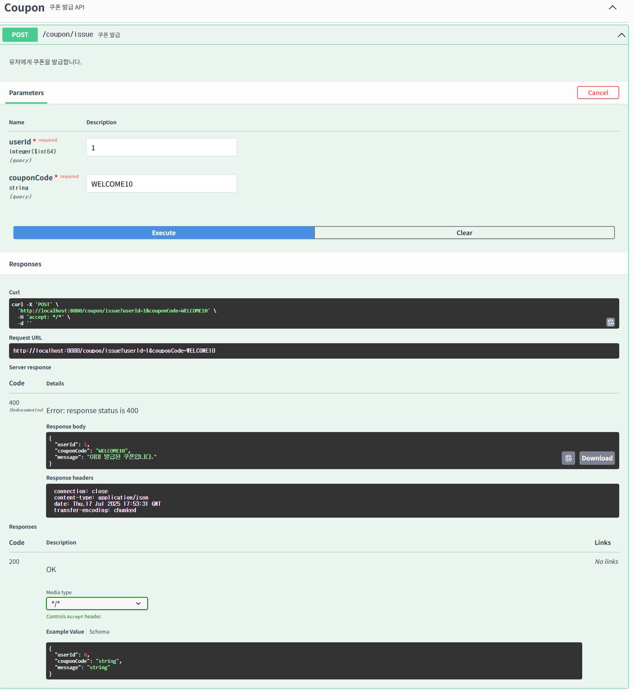
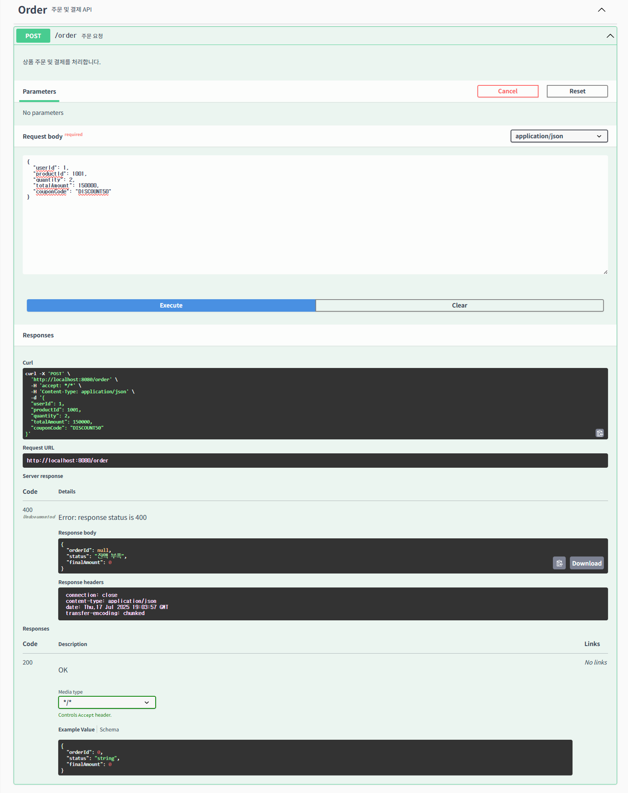

## 프로젝트

## Getting Started

### Prerequisites

#### Running Docker Containers

`local` profile 로 실행하기 위하여 인프라가 설정되어 있는 Docker 컨테이너를 실행해주셔야 합니다.

```bash
docker-compose up -d
```
---

### 🔍 Swagger API 명세

실행 후, http://localhost:8080/swagger-ui/index.html 에서 API 명세를 확인할 수 있습니다.

- 명세 JSON 파일: [`docs/swagger/swagger.json`](./docs/swagger/swagger.json)

---
#### ✅ Swagger  화면 캡처

#### 🔹 잔액 조회 API


#### 🔹 포인트 충전 API


#### 🔹 쿠폰 발급 API


#### 🔹 주문 결제 API

---

### 📌 주요 API 요약

| 기능             | 메서드 | 경로                  | 설명                         |
|------------------|--------|------------------------|------------------------------|
| 포인트 잔액 조회 | `GET`  | `/balance/{userId}`    | 유저 포인트 잔액 조회       |
| 포인트 충전      | `POST` | `/balance/charge`      | 유저 포인트 충전            |
| 쿠폰 발급        | `POST` | `/coupon/issue`        | 조건 충족 시 선착순 쿠폰 발급 |
| 주문/결제        | `POST` | `/order`               | 재고 차감 + 포인트 결제 수행 |