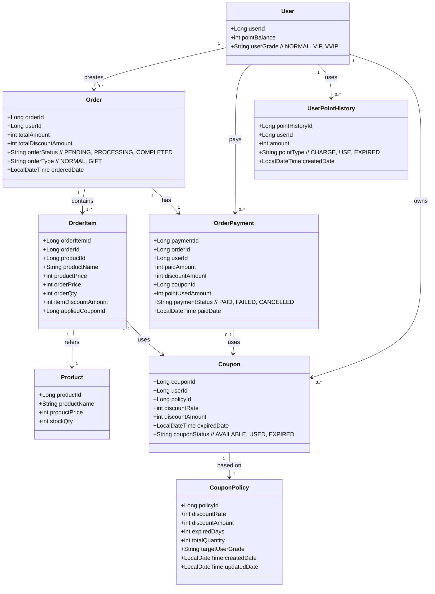

```mermaid
classDiagram

class User {
    +Long userId
    +int pointBalance
    +String userGrade  // NORMAL, VIP, VVIP
}

class Order {
    +Long orderId
    +Long userId
    +int totalAmount
    +int totalDiscountAmount
    +String orderStatus  // PENDING, PROCESSING, COMPLETED
    +String orderType    // NORMAL, GIFT
    +LocalDateTime orderedDate
}

class OrderItem {
    +Long orderItemId
    +Long orderId
    +Long productId
    +String productName
    +int productPrice
    +int orderPrice
    +int orderQty
    +int itemDiscountAmount
    +Long appliedCouponId
}

class Product {
    +Long productId
    +String productName
    +int productPrice
    +int stockQty
}

class OrderPayment {
    +Long paymentId
    +Long orderId
    +Long userId
    +int paidAmount
    +int discountAmount
    +Long couponId
    +int pointUsedAmount
    +String paymentStatus // PAID, FAILED, CANCELLED
    +LocalDateTime paidDate
}

class UserPointHistory {
    +Long pointHistoryId
    +Long userId
    +int amount
    +String pointType  // CHARGE, USE, EXPIRED
    +LocalDateTime createdDate
}

class Coupon {
    +Long couponId
    +Long userId
    +Long policyId
    +int discountRate
    +int discountAmount
    +LocalDateTime expiredDate
    +String couponStatus  // AVAILABLE, USED, EXPIRED
}

class CouponPolicy {
    +Long policyId
    +int discountRate
    +int discountAmount
    +int expiredDays
    +int totalQuantity
    +String targetUserGrade
    +LocalDateTime createdDate
    +LocalDateTime updatedDate
}

%% 관계 설정
User "1" --> "0..*" Order : creates
User "1" --> "0..*" OrderPayment : pays
User "1" --> "0..*" UserPointHistory : uses
User "1" --> "0..*" Coupon : owns

Order "1" --> "1..*" OrderItem : contains
Order "1" --> "1" OrderPayment : has

OrderItem "1" --> "1" Product : refers
OrderItem "0..1" --> Coupon : uses

OrderPayment "0..1" --> Coupon : uses

Coupon "1" --> "1" CouponPolicy : based on

```