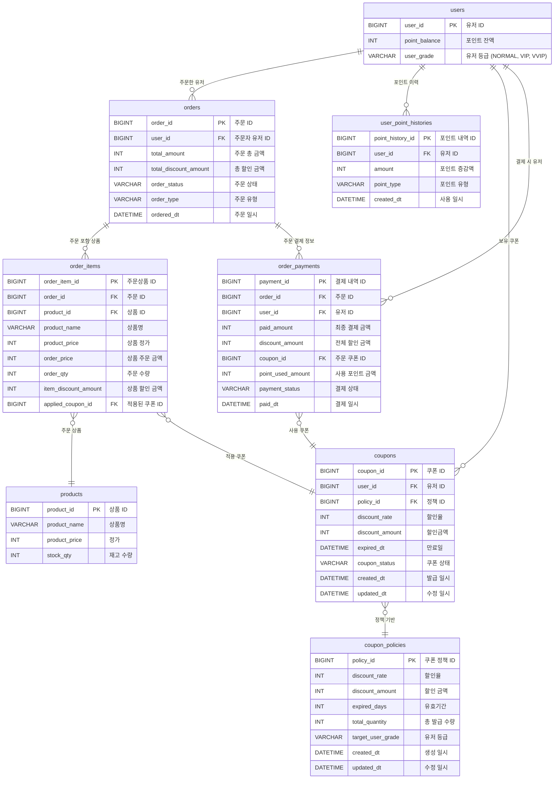

```mermaid
---
config:
  theme: default
---
erDiagram
    users {
        BIGINT user_id PK "유저 ID"
        INT point_balance "포인트 잔액"
        VARCHAR user_grade "유저 등급 (NORMAL, VIP, VVIP)"
    }
    orders {
        BIGINT order_id PK "주문 ID"
        BIGINT user_id FK "주문자 유저 ID"
        INT total_amount "주문 총 금액"
        INT total_discount_amount "총 할인 금액"
        VARCHAR order_status "주문 상태"
        VARCHAR order_type "주문 유형"
        DATETIME ordered_dt "주문 일시"
    }
    order_items {
        BIGINT order_item_id PK "주문상품 ID"
        BIGINT order_id FK "주문 ID"
        BIGINT product_id FK "상품 ID"
        VARCHAR product_name "상품명"
        INT product_price "상품 정가"
        INT order_price "상품 주문 금액"
        INT order_qty "주문 수량"
        INT item_discount_amount "상품 할인 금액"
        BIGINT applied_coupon_id FK "적용된 쿠폰 ID"
    }
    order_payments {
        BIGINT payment_id PK "결제 내역 ID"
        BIGINT order_id FK "주문 ID"
        BIGINT user_id FK "유저 ID"
        INT paid_amount "최종 결제 금액"
        INT discount_amount "전체 할인 금액"
        BIGINT coupon_id FK "주문 쿠폰 ID"
        INT point_used_amount "사용 포인트 금액"
        VARCHAR payment_status "결제 상태"
        DATETIME paid_dt "결제 일시"
    }
    products {
        BIGINT product_id PK "상품 ID"
        VARCHAR product_name "상품명"
        INT product_price "정가"
        INT stock_qty "재고 수량"
    }
    user_point_histories {
        BIGINT point_history_id PK "포인트 내역 ID"
        BIGINT user_id FK "유저 ID"
        INT amount "포인트 증감액"
        VARCHAR point_type "포인트 유형"
        DATETIME created_dt "사용 일시"
    }
    coupon_policies {
        BIGINT policy_id PK "쿠폰 정책 ID"
        INT discount_rate "할인율"
        INT discount_amount "할인 금액"
        INT expired_days "유효기간"
        INT total_quantity "총 발급 수량"
        VARCHAR target_user_grade "유저 등급"
        DATETIME created_dt "생성 일시"
        DATETIME updated_dt "수정 일시"
    }
    coupons {
        BIGINT coupon_id PK "쿠폰 ID"
        BIGINT user_id FK "유저 ID"
        BIGINT policy_id FK "정책 ID"
        INT discount_rate "할인율"
        INT discount_amount "할인금액"
        DATETIME expired_dt "만료일"
        VARCHAR coupon_status "쿠폰 상태"
        DATETIME created_dt "발급 일시"
        DATETIME updated_dt "수정 일시"
    }
    users ||--o{ orders : "주문한 유저"
    users ||--o{ user_point_histories : "포인트 이력"
    users ||--o{ coupons : "보유 쿠폰"
    users ||--o{ order_payments : "결제 시 유저"
    orders ||--o{ order_items : "주문 포함 상품"
    orders ||--o{ order_payments : "주문 결제 정보"
    order_items }o--|| products : "주문 상품"
    order_items }o--|| coupons : "적용 쿠폰"
    order_payments }o--|| coupons : "사용 쿠폰"
    coupons }o--|| coupon_policies : "정책 기반"
```