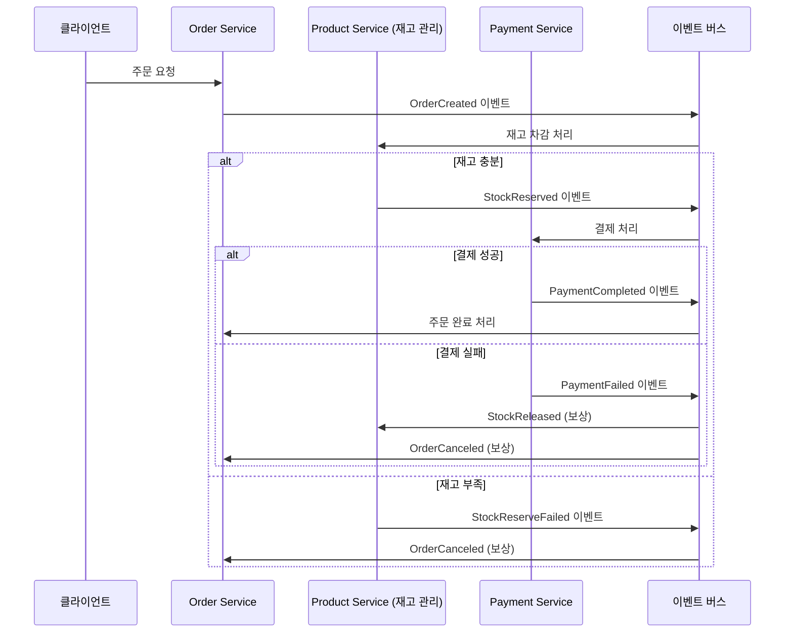

# 도메인 분리 환경에서의 트랜잭션 처리 설계 문서

## 1. 서론
서비스가 확장됨에 따라 단일 애플리케이션과 데이터베이스만으로는 더 이상 요구사항을 충족하기 어려워지고, 이를 해결하기 위해 도메인 단위의 애플리케이션 서버 및 데이터베이스 분리(MSA, Microservice Architecture)가 활발히 도입되고 있다.
그러나 이러한 도메인 분리 환경은 기존 단일 트랜잭션 모델이 보장하던 일관성(Consistency)과 원자성(Atomicity)을 확보하기 어렵다는 새로운 문제를 낳고 있으며, 본 문서는 이러한 한계를 분석하고 Choreography SAGA 패턴, 보상 트랜잭션(Compensating Transaction)등을 활용한 설계 방안을 제시하고자 한다.

---

## 2. 문제 정의: 도메인 단위 트랜잭션의 한계

### 2.1 현재 구조의 문제점
기존 `OrderFacade`는 단일 트랜잭션으로 여러 도메인을 처리:

```java
@Transactional
@DistributedLock(key = "multi:#request.getProductIds()", waitTime = 3, leaseTime = 10)
public OrderResponse createOrder(OrderRequest request) {
    // Product 도메인: 재고 확인/차감
    List<OrderItem> orderItems = prepareOrderItems(request.getOrderItems());

    // Order 도메인: 주문 생성  
    Order order = orderService.createOrder(userId, orderItems);

    // Payment 도메인: 결제 처리
    processPayment(order, userId, request.getUsedAmount(), orderItems);

    // 이벤트 발행
    eventPublisher.publishEvent(OrderEvents.OrderCompleted.from(order));
}
```

### 2.2 도메인 분리 시 발생 문제
도메인별로 서버와 DB를 분리할 경우 다음과 같은 문제가 발생:

1. **단일 트랜잭션의 부재**
    - 주문 생성 → 재고 차감 → 결제 처리 과정을 하나의 ACID 트랜잭션으로 묶을 수 없음
    - 각 도메인이 독립된 데이터베이스를 가지므로 분산 트랜잭션 필요

2. **분산 트랜잭션 관리의 복잡성**
    - 2PC(2-Phase Commit)는 성능 저하 및 장애 전파 문제로 실무 적용이 어려움
    - 네트워크 파티션 시 전체 시스템 블로킹 가능성

3. **데이터 일관성 문제**
    - 이벤트 발행과 DB 커밋 간 불일치 발생 시 데이터 불일치 가능성 존재
    - 주문 생성 후 이벤트 발행 실패 시 재고/결제 처리 누락

4. **부분 실패 처리의 어려움**
    - 일부 도메인 성공, 일부 도메인 실패 시 롤백 전략 필요
    - 재고 차감 성공 → 결제 실패 시 재고 복구 메커니즘 필요

---

## 3. 설계 전략

### 3.1 고려 사항
- 도메인 분리는 곧 트랜잭션 분리를 의미하며, **보상 트랜잭션 전략**이 필수적이다.
- 단순 이벤트 발행만으로는 **트랜잭션 일관성**을 확보할 수 없으며, **Outbox/CDC 기반의 원자성 보장**이 필요하다.
- SAGA 패턴을 통해 **분산 환경에서도 안정적인 트랜잭션 흐름**을 설계할 수 있다.

### 3.2 설계 방향
1. **Choreography SAGA 패턴** 적용으로 서비스 자율성 확보
2. **Outbox 패턴**을 통한 이벤트 발행 원자성 보장
3. **보상 트랜잭션**으로 실패 시 일관성 복구
4. **멱등성 보장**으로 중복 처리 방지

### 3.3 단계별 마이그레이션 전략
1. **1단계**: 기존 ProductService에 이벤트 처리 추가
2. **2단계**: 향후 독립된 InventoryService로 분리 (확장성 확보)

---

## 4. Choreography SAGA 패턴 설계

### 4.1 개념
Choreography SAGA는 **중앙 오케스트레이터 없이**, 각 서비스가 이벤트를 발행·구독하며 다음 단계를 자율적으로 진행하는 구조

**선택 이유:**
- SPOF(Single Point of Failure) 제거
- 서비스 독립성 강화 및 확장성 확보
- 새로운 도메인 추가 시 기존 서비스 변경 최소화

### 4.2 이벤트 흐름 설계


### 4.3 트랜잭션 매트릭스
| 단계 | 서비스 | 로컬 트랜잭션 | 발행 이벤트 | 실패 시 보상 이벤트 |
|------|--------|---------------|-------------|-------------------|
| 1 | Order Service | 주문 생성 + Outbox | OrderCreated | - |
| 2 | Product Service | 재고 차감 + Outbox | StockReserved / StockReserveFailed | StockReleased |
| 3 | Payment Service | 결제 처리 + Outbox | PaymentCompleted / PaymentFailed | - |
| 보상1 | Product Service | 재고 복구 + Outbox | StockReleased | - |
| 보상2 | Order Service | 주문 취소 + Outbox | OrderCanceled | - |

### 4.4 핵심 서비스 구현

#### Order Service
```java
@Service
public class OrderService {
    
    @Transactional
    public void createOrder(OrderRequest request) {
        // 주문 생성 (로컬 트랜잭션)
        Order order = Order.createOrder(request.getUserId());
        orderRepository.save(order);
        
        // Outbox 이벤트 저장 (동일 트랜잭션)
        publishOutboxEvent("OrderCreated", OrderCreatedEvent.from(order));
    }
    
    @EventListener
    @Transactional
    public void handlePaymentCompleted(PaymentCompletedEvent event) {
        Order order = orderRepository.findById(event.getOrderId());
        order.complete();
        publishOutboxEvent("OrderCompleted", OrderCompletedEvent.from(order));
    }
    
    @EventListener
    @Transactional
    public void handleStockReserveFailed(StockReserveFailedEvent event) {
        Order order = orderRepository.findById(event.getOrderId());
        order.cancel("재고 부족");
        publishOutboxEvent("OrderCanceled", OrderCanceledEvent.from(order));
    }
}
```

#### ProductService (현재 단계 - 재고 관리 포함)
```java
@Service
@RequiredArgsConstructor
public class ProductService {
    private final ProductRepository productRepository;
    private final RedisTemplate<String, String> redisTemplate;
    private final ApplicationEventPublisher eventPublisher;
    private final OutboxRepository outboxRepository;
    private final ProcessedEventRepository processedEventRepository;
    
    // === 기존 메서드들 유지 ===
    
    // 상품 조회 관련
    public Product getProduct(Long productId) {
        return productRepository.findById(productId)
                .orElseThrow(() -> new EntityNotFoundException("상품을 찾을 수 없습니다. id=" + productId));
    }
    
    public List<ProductResponse> getProducts() {
        List<Product> products = productRepository.findAll();
        return products.stream()
                .map(ProductResponse::new)
                .collect(Collectors.toList());
    }
    
    // 재고 처리 관련 (기존 메서드 유지)
    @Transactional
    public void decreaseStockWithPessimisticLock(Long productId, int quantity) {
        Product product = productRepository.findByIdWithPessimisticLock(productId)
                .orElseThrow(() -> new EntityNotFoundException("상품을 찾을 수 없습니다. id=" + productId));
        product.decreaseStock(quantity);
        productRepository.save(product);
    }
    
    @Transactional
    public void recoverStocksWithPessimisticLock(List<OrderItem> orderItems) {
        for (OrderItem item : orderItems) {
            try {
                productRepository.findByIdWithPessimisticLock(item.getProductId())
                        .ifPresent(product -> {
                            product.increaseStock(item.getOrderItemQty());
                            productRepository.save(product);
                        });
            } catch (Exception e) {
                throw new StockRecoveryException(item.getProductId(), e.getMessage());
            }
        }
    }
    
    // === 이벤트 처리 추가 (SAGA 패턴 지원) ===
    
    /**
     * 주문 생성 이벤트 처리 - 재고 차감
     */
    @EventListener
    @Transactional
    public void handleOrderCreated(OrderCreatedEvent event) {
        String idempotencyKey = event.getOrderId() + ":stock-reserve";
        
        // 멱등성 보장
        if (isAlreadyProcessed(idempotencyKey)) {
            log.info("재고 차감 이미 처리됨: {}", event.getOrderId());
            return;
        }
        
        try {
            // 기존 메서드 활용하여 재고 차감
            for (OrderItem item : event.getOrderItems()) {
                decreaseStockWithPessimisticLock(item.getProductId(), item.getOrderItemQty());
            }
            
            // 성공 이벤트 발행
            publishOutboxEvent("StockReserved", 
                StockReservedEvent.from(event.getOrderId(), event.getOrderItems()));
                
        } catch (InsufficientStockException e) {
            // 재고 부족 이벤트 발행
            publishOutboxEvent("StockReserveFailed", 
                StockReserveFailedEvent.from(event.getOrderId(), e.getMessage()));
        } catch (Exception e) {
            log.error("재고 차감 처리 중 오류 발생: 주문ID {}", event.getOrderId(), e);
            publishOutboxEvent("StockReserveFailed", 
                StockReserveFailedEvent.from(event.getOrderId(), "시스템 오류"));
        }
        
        markAsProcessed(idempotencyKey);
    }
    
    /**
     * 결제 실패 이벤트 처리 - 재고 복구 (보상 트랜잭션)
     */
    @EventListener
    @Transactional
    public void handlePaymentFailed(PaymentFailedEvent event) {
        String compensationKey = event.getOrderId() + ":stock-compensation";
        
        // 멱등성 보장
        if (isAlreadyProcessed(compensationKey)) {
            log.info("재고 보상 이미 처리됨: {}", event.getOrderId());
            return;
        }
        
        try {
            // 기존 메서드 활용하여 재고 복구
            recoverStocksWithPessimisticLock(event.getOrderItems());
            
            // 재고 복구 완료 이벤트 발행
            publishOutboxEvent("StockReleased", 
                StockReleasedEvent.from(event.getOrderId()));
                
        } catch (Exception e) {
            log.error("재고 보상 처리 중 오류 발생: 주문ID {}", event.getOrderId(), e);
            // 보상 트랜잭션 실패 시 알람/모니터링 필요
        }
        
        markAsProcessed(compensationKey);
    }
    
    // === 이벤트 관련 헬퍼 메서드 ===
    
    @Transactional
    private void publishOutboxEvent(String eventType, Object data) {
        OutboxEvent event = OutboxEvent.builder()
            .eventType(eventType)
            .eventData(JsonUtils.toJson(data))
            .idempotencyKey(generateIdempotencyKey(data))
            .occurredAt(LocalDateTime.now())
            .status("NEW")
            .build();
        
        outboxRepository.save(event);
    }
    
    private boolean isAlreadyProcessed(String idempotencyKey) {
        return processedEventRepository.existsByIdempotencyKey(idempotencyKey);
    }
    
    private void markAsProcessed(String idempotencyKey) {
        processedEventRepository.save(
            ProcessedEvent.create(idempotencyKey, "ProductService")
        );
    }
    
    private String generateIdempotencyKey(Object data) {
        // 데이터 기반 멱등성 키 생성 로직
        return UUID.randomUUID().toString();
    }
}
```

---

## 5. 향후 확장 계획: InventoryService 분리

### 5.1 분리 목적
현재 ProductService가 가진 **두 가지 책임을 분리**하여 각각의 전문성을 높이고 독립적 확장을 가능하게 함:

- **ProductService**: 상품 정보 관리 (카탈로그, 조회 중심)
- **InventoryService**: 재고 관리 (트랜잭션, 동시성 제어 중심)

### 5.2 분리 후 구조
```java
// 향후 ProductService (상품 정보만 담당)
@Service
public class ProductService {
    // 상품 조회 관련만 유지
    public Product getProduct(Long productId) { /* 기존 구현 유지 */ }
    public List<ProductResponse> getProducts() { /* 기존 구현 유지 */ }
    public ProductDetailResponse getProductById(Long productId) { /* 기존 구현 유지 */ }
    public List<TopProductResponse> getTopSellingProducts() { /* 기존 구현 유지 */ }
    
    // 재고 관련 메서드 제거 예정
}

// 새로운 InventoryService (재고 전용)
@Service
public class InventoryService {
    @Autowired
    private ProductService productService; // 기존 재고 로직 활용
    
    @EventListener
    @Transactional
    public void handleOrderCreated(OrderCreatedEvent event) {
        // ProductService의 재고 메서드 위임 호출
        for (OrderItem item : event.getOrderItems()) {
            productService.decreaseStockWithPessimisticLock(
                item.getProductId(), item.getOrderItemQty()
            );
        }
        publishOutboxEvent("StockReserved", ...);
    }
    
    @EventListener
    @Transactional
    public void handlePaymentFailed(PaymentFailedEvent event) {
        // ProductService의 보상 메서드 위임 호출
        productService.recoverStocksWithPessimisticLock(event.getOrderItems());
        publishOutboxEvent("StockReleased", ...);
    }
}
```

### 5.3 분리 시점과 기준
**분리를 고려할 시점:**
- 재고 관리 로직이 복잡해질 때 (예약 재고, 안전 재고 등)
- 재고 관련 성능 최적화가 필요할 때
- 재고 관리만을 위한 별도 DB/캐시 전략이 필요할 때
- 조직적으로 재고 관리 전담 팀이 생길 때

**마이그레이션 전략:**
1. InventoryService 생성 후 ProductService 위임 호출
2. 점진적으로 재고 로직을 InventoryService로 이관
3. ProductService에서 재고 관련 코드 제거
4. 필요시 별도 데이터베이스 분리

---

## 6. 보상 트랜잭션 설계

### 6.1 개념
보상 트랜잭션은 실패 시 **이전 단계의 결과를 되돌리는 반대 연산**으로, 단순 DB 롤백이 아니라 **비즈니스적으로 의미 있는 보정 작업**이어야 함.

### 6.2 보상 작업 매트릭스
| 원본 트랜잭션 | 보상 트랜잭션 | 구현 위치 | 비고 |
|-------------|-------------|----------|------|
| 재고 차감 | 재고 복구 | ProductService | 기존 recoverStocksWithPessimisticLock 활용 |
| 결제 승인 | 결제 취소/환불 | PaymentService | PG사 API 연동 |
| 쿠폰 사용 | 쿠폰 복구 | CouponService | 쿠폰 상태 원복 |
| 포인트 차감 | 포인트 복구 | PointService | 잔액 원복 |

### 6.3 설계 원칙
1. **멱등성(Idempotency)**: 여러 번 실행되어도 동일한 결과 보장
2. **확실성**: 보상 트랜잭션은 반드시 성공해야 함
3. **비즈니스 의미**: 단순 DB 롤백이 아닌 비즈니스 관점의 취소 작업

---

## 7. 트랜잭션 일관성 보장 전략

### 7.1 Outbox 패턴
이벤트 발행과 로컬 트랜잭션 커밋 간 원자성을 보장하기 위한 패턴

**Outbox 테이블 구조:**
```sql
CREATE TABLE outbox_events (
    id UUID PRIMARY KEY,
    aggregate_type VARCHAR(50),     -- ORDER, PRODUCT, PAYMENT
    aggregate_id VARCHAR(255),      -- 주문ID, 상품ID 등
    event_type VARCHAR(100),        -- OrderCreated, StockReserved
    event_data JSONB,               -- 이벤트 페이로드
    idempotency_key VARCHAR(255),   -- 중복 처리 방지
    occurred_at TIMESTAMP,
    processed_at TIMESTAMP,
    status VARCHAR(20) DEFAULT 'NEW' -- NEW, SENT, FAILED
);
```

### 7.2 멱등성 보장
```sql
CREATE TABLE processed_events (
    idempotency_key VARCHAR(255) PRIMARY KEY,
    event_type VARCHAR(100),
    processed_at TIMESTAMP,
    service_name VARCHAR(50)
);
```

---

## 8. 장단점 분석 및 대응

### 8.1 현재 접근법의 장점
- **점진적 도입**: 기존 ProductService 코드 최대한 활용
- **위험 최소화**: 검증된 재고 관리 로직 재사용
- **빠른 적용**: 이벤트 처리만 추가하면 SAGA 패턴 적용 가능

### 8.2 단점 및 대응
| 단점 | 대응 방안 |
|------|----------|
| **ProductService 책임 과다** | 향후 InventoryService 분리 계획 |
| **전체 흐름 파악 어려움** | 분산 추적(Distributed Tracing) 도입 |
| **디버깅 복잡성** | 중앙화된 로깅 및 모니터링 |

### 8.3 장애 대응 매트릭스
| 장애 상황 | 감지 방법 | 대응 절차 | 복구 전략 |
|----------|----------|----------|----------|
| **Outbox 발행 실패** | 메트릭 알람 | Relayer 재시작, 실패 이벤트 재처리 | 지수 백오프 재시도 |
| **재고 차감 실패** | 비즈니스 로그 | 재고 부족 확인, 주문 취소 처리 | 자동 보상 트랜잭션 |
| **결제 승인 실패** | PG 응답 코드 | PG사 장애 확인, 재고 복구 처리 | 자동 보상 트랜잭션 |
| **중복 메시지** | 중복 처리 로그 | 멱등성으로 자동 처리 | 별도 조치 불필요 |

---

## 9. 결론

### 9.1 단계별 도입 전략
1. **현재**: ProductService에 이벤트 처리 추가로 SAGA 패턴 적용
2. **단기**: 분산 추적 및 모니터링 체계 구축
3. **장기**: InventoryService 분리를 통한 도메인 전문화

### 9.2 핵심 성과
- **기존 코드 활용**: 검증된 재고 관리 로직 재사용으로 안정성 확보
- **점진적 전환**: 위험 최소화하며 MSA 패턴 도입
- **확장 가능성**: 향후 InventoryService 분리를 통한 전문화 가능

### 9.3 최종 평가
> 현재 ProductService를 기반으로 한 Choreography SAGA 패턴 적용을 통해 기존 안정성을 유지하면서도 분산 트랜잭션의 일관성을 확보할 수 있음을 확인하였다. 향후 서비스 성장에 따라 InventoryService 분리를 통해 더욱 전문화된 재고 관리 체계로 발전시킬 수 있는 확장 가능한 설계가 완성되었다.