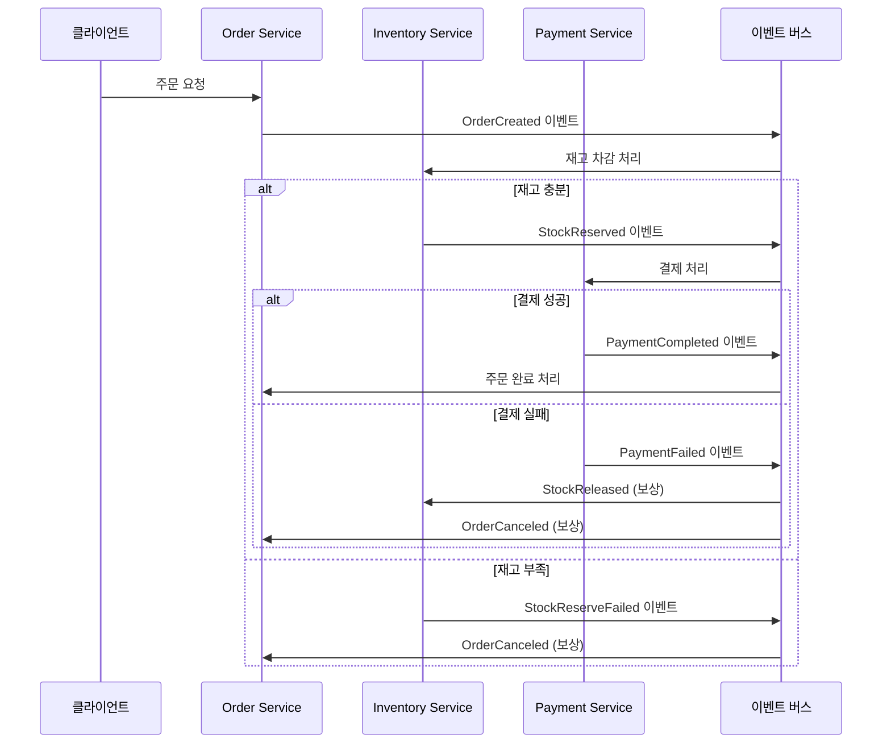

# 도메인 분리 환경에서의 트랜잭션 처리 설계 보고서

## 1. 서론
서비스가 확장됨에 따라 단일 애플리케이션과 데이터베이스만으로는 더 이상 요구사항을 충족하기 어려워지고, 이를 해결하기 위해 **도메인 단위의 애플리케이션 서버 및 데이터베이스 분리(MSA, Microservice Architecture)**가 활발히 도입되고 있다.
그러나 이러한 도메인 분리 환경은 기존 단일 트랜잭션 모델이 보장하던 **일관성(Consistency)**과 **원자성(Atomicity)**을 확보하기 어렵다는 새로운 문제를 낳고 있으며, 본 문서는 이러한 한계를 분석하고 Choreography SAGA 패턴, 보상 트랜잭션(Compensating Transaction), Outbox 패턴을 활용한 설계 방안을 제시하고자 한다.
---

## 2. 문제 정의: 도메인 단위 트랜잭션의 한계

### 2.1 현재 구조의 문제점
기존 `OrderFacade`는 단일 트랜잭션으로 여러 도메인을 처리:

```java
@Transactional
@DistributedLock(key = "multi:#request.getProductIds()", waitTime = 3, leaseTime = 10)
public OrderResponse createOrder(OrderRequest request) {
    // Product 도메인: 재고 확인/차감
    List<OrderItem> orderItems = prepareOrderItems(request.getOrderItems());
    
    // Order 도메인: 주문 생성  
    Order order = orderService.createOrder(userId, orderItems);
    
    // Payment 도메인: 결제 처리
    processPayment(order, userId, request.getUsedAmount(), orderItems);
    
    // 이벤트 발행
    eventPublisher.publishEvent(OrderEvents.OrderCompleted.from(order));
}
```

### 2.2 도메인 분리 시 발생 문제
도메인별로 서버와 DB를 분리할 경우 다음과 같은 문제가 발생:

1. **단일 트랜잭션의 부재**
    - 주문 생성 → 재고 차감 → 결제 처리 과정을 하나의 ACID 트랜잭션으로 묶을 수 없음
    - 각 도메인이 독립된 데이터베이스를 가지므로 분산 트랜잭션 필요

2. **분산 트랜잭션 관리의 복잡성**
    - 2PC(2-Phase Commit)는 성능 저하 및 장애 전파 문제로 실무 적용이 어려움
    - 네트워크 파티션 시 전체 시스템 블로킹 가능성

3. **데이터 일관성 문제**
    - 이벤트 발행과 DB 커밋 간 불일치 발생 시 데이터 불일치 가능성 존재
    - 주문 생성 후 이벤트 발행 실패 시 재고/결제 처리 누락

4. **부분 실패 처리의 어려움**
    - 일부 도메인 성공, 일부 도메인 실패 시 롤백 전략 필요
    - 재고 차감 성공 → 결제 실패 시 재고 복구 메커니즘 필요

---

## 3. 핵심 설계 전략

### 3.1 고려 사항
- 도메인 분리는 곧 트랜잭션 분리를 의미하며, **보상 트랜잭션 전략**이 필수적이다.
- 단순 이벤트 발행만으로는 **트랜잭션 일관성**을 확보할 수 없으며, **Outbox/CDC 기반의 원자성 보장**이 필요하다.
- SAGA 패턴을 통해 **분산 환경에서도 안정적인 트랜잭션 흐름**을 설계할 수 있다.

### 3.2 설계 방향
1. **Choreography SAGA 패턴** 적용으로 서비스 자율성 확보
2. **Outbox 패턴**을 통한 이벤트 발행 원자성 보장
3. **보상 트랜잭션**으로 실패 시 일관성 복구
4. **멱등성 보장**으로 중복 처리 방지

---

## 4. Choreography SAGA 패턴 설계

### 4.1 개념
Choreography SAGA는 **중앙 오케스트레이터 없이**, 각 서비스가 이벤트를 발행·구독하며 다음 단계를 자율적으로 진행하는 구조

**선택 이유:**
- SPOF(Single Point of Failure) 제거
- 서비스 독립성 강화 및 확장성 확보
- 새로운 도메인 추가 시 기존 서비스 변경 최소화

### 4.2 이벤트 흐름 설계


### 4.3 트랜잭션 매트릭스
| 단계 | 서비스 | 로컬 트랜잭션 | 발행 이벤트 | 실패 시 보상 이벤트 |
|------|--------|---------------|-------------|-------------------|
| 1 | Order Service | 주문 생성 + Outbox | OrderCreated | - |
| 2 | Inventory Service | 재고 차감 + Outbox | StockReserved / StockReserveFailed | StockReleased |
| 3 | Payment Service | 결제 처리 + Outbox | PaymentCompleted / PaymentFailed | - |
| 보상1 | Inventory Service | 재고 복구 + Outbox | StockReleased | - |
| 보상2 | Order Service | 주문 취소 + Outbox | OrderCanceled | - |

### 4.4 핵심 서비스 구현 예시

#### Order Service
```java
@Service
public class OrderService {
    
    @Transactional
    public void createOrder(OrderRequest request) {
        // 주문 생성 (로컬 트랜잭션)
        Order order = Order.createOrder(request.getUserId());
        orderRepository.save(order);
        
        // Outbox 이벤트 저장 (동일 트랜잭션)
        publishOutboxEvent("OrderCreated", OrderCreatedEvent.from(order));
    }
    
    @EventHandler
    @Transactional
    public void handlePaymentCompleted(PaymentCompletedEvent event) {
        Order order = orderRepository.findById(event.getOrderId());
        order.complete();
        publishOutboxEvent("OrderCompleted", OrderCompletedEvent.from(order));
    }
    
    @EventHandler
    @Transactional
    public void handleStockReserveFailed(StockReserveFailedEvent event) {
        Order order = orderRepository.findById(event.getOrderId());
        order.cancel("재고 부족");
        publishOutboxEvent("OrderCanceled", OrderCanceledEvent.from(order));
    }
}
```

#### Inventory Service
```java
@Service  
public class InventoryService {
    
    @EventHandler
    @Transactional
    public void handleOrderCreated(OrderCreatedEvent event) {
        String idempotencyKey = event.getOrderId() + ":stock-reserve";
        
        if (isAlreadyProcessed(idempotencyKey)) return;
        
        try {
            // 기존 ProductService 활용
            for (OrderItem item : event.getOrderItems()) {
                productService.decreaseStockWithPessimisticLock(
                    item.getProductId(), item.getOrderItemQty()
                );
            }
            
            publishOutboxEvent("StockReserved", 
                StockReservedEvent.from(event.getOrderId(), event.getOrderItems()));
                
        } catch (InsufficientStockException e) {
            publishOutboxEvent("StockReserveFailed", 
                StockReserveFailedEvent.from(event.getOrderId(), e.getMessage()));
        }
        
        markAsProcessed(idempotencyKey);
    }
    
    // 보상 트랜잭션
    @EventHandler
    @Transactional  
    public void handlePaymentFailed(PaymentFailedEvent event) {
        String compensationKey = event.getOrderId() + ":stock-compensation";
        
        if (isAlreadyProcessed(compensationKey)) return;
        
        // 기존 ProductService.recoverStocks 활용
        productService.recoverStocksWithPessimisticLock(event.getOrderItems());
        
        publishOutboxEvent("StockReleased", 
            StockReleasedEvent.from(event.getOrderId()));
            
        markAsProcessed(compensationKey);
    }
}
```

---

## 5. 보상 트랜잭션 설계

### 5.1 개념
보상 트랜잭션은 실패 시 **이전 단계의 결과를 되돌리는 반대 연산**으로, 단순 DB 롤백이 아니라 **비즈니스적으로 의미 있는 보정 작업**이어야 함.

### 5.2 보상 작업 매트릭스
| 원본 트랜잭션 | 보상 트랜잭션 | 비고 |
|-------------|-------------|------|
| 재고 차감 | 재고 복구 | 수량 원복 |
| 결제 승인 | 결제 취소/환불 | PG사 API 연동 |
| 쿠폰 사용 | 쿠폰 복구 | 쿠폰 상태 원복 |
| 포인트 차감 | 포인트 복구 | 잔액 원복 |

### 5.3 설계 원칙
1. **멱등성(Idempotency)**: 여러 번 실행되어도 동일한 결과 보장
2. **확실성**: 보상 트랜잭션은 반드시 성공해야 함
3. **비즈니스 의미**: 단순 DB 롤백이 아닌 비즈니스 관점의 취소 작업

### 5.4 구현 예시
```java
@EventHandler
@Transactional
public void handlePaymentFailed(PaymentFailedEvent event) {
    String idempotencyKey = event.getOrderId() + ":stock-compensation";
    
    // 멱등성 보장을 위한 중복 검사
    if (compensationRepository.existsByIdempotencyKey(idempotencyKey)) {
        log.info("재고 보상 이미 처리됨: {}", event.getOrderId());
        return;
    }
    
    // 재고 복구 처리
    for (OrderItem item : event.getOrderItems()) {
        Stock stock = stockRepository.findByProductId(item.getProductId());
        stock.increase(item.getQuantity());
        stockRepository.save(stock);
    }
    
    // 보상 처리 완료 기록
    compensationRepository.save(
        CompensationRecord.builder()
            .idempotencyKey(idempotencyKey)
            .eventType("StockCompensation")
            .processedAt(LocalDateTime.now())
            .build()
    );
    
    log.info("재고 보상 완료: 주문ID {}", event.getOrderId());
}
```

---

## 6. 트랜잭션 일관성 보장 전략

### 6.1 Outbox 패턴
이벤트 발행과 로컬 트랜잭션 커밋 간 원자성을 보장하기 위한 패턴

**동작 원리:**
- 비즈니스 데이터 + Outbox 이벤트를 **동일 DB 트랜잭션**에서 저장
- 별도 Relayer/CDC가 Outbox를 브로커로 발행

**Outbox 테이블 구조:**
```sql
CREATE TABLE outbox_events (
    id UUID PRIMARY KEY,
    aggregate_type VARCHAR(50),     -- ORDER, INVENTORY, PAYMENT
    aggregate_id VARCHAR(255),      -- 주문ID, 재고ID 등
    event_type VARCHAR(100),        -- OrderCreated, StockReserved
    event_data JSONB,               -- 이벤트 페이로드
    idempotency_key VARCHAR(255),   -- 중복 처리 방지
    occurred_at TIMESTAMP,
    processed_at TIMESTAMP,
    status VARCHAR(20) DEFAULT 'NEW' -- NEW, SENT, FAILED
);
```

**구현 예시:**
```java
@Transactional
public void publishOutboxEvent(String eventType, Object data) {
    OutboxEvent event = OutboxEvent.builder()
        .eventType(eventType)
        .eventData(JsonUtils.toJson(data))
        .idempotencyKey(generateIdempotencyKey(data))
        .occurredAt(LocalDateTime.now())
        .status("NEW")
        .build();
    
    outboxRepository.save(event); // 비즈니스 데이터와 함께 커밋
}
```

### 6.2 멱등성 보장
```sql
CREATE TABLE processed_events (
    idempotency_key VARCHAR(255) PRIMARY KEY,
    event_type VARCHAR(100),
    processed_at TIMESTAMP,
    service_name VARCHAR(50)
);
```

```java
private boolean isAlreadyProcessed(String idempotencyKey) {
    return processedEventRepository.existsByIdempotencyKey(idempotencyKey);
}

private void markAsProcessed(String idempotencyKey) {
    processedEventRepository.save(
        ProcessedEvent.create(idempotencyKey, "StockReserved")
    );
}
```

---

## 7. 장단점 분석 및 대응

### 7.1 Choreography 패턴의 장점
- 서비스 간 **느슨한 결합** 확보
- **확장성**: 신규 서비스 추가 시 기존 서비스 수정 최소화
- SPOF 제거로 시스템 안정성 향상
- 각 서비스의 자율적 개발/배포 가능

### 7.2 단점 및 대응
| 단점 | 대응 방안 |
|------|----------|
| **전체 흐름 파악 어려움** | 분산 추적(Distributed Tracing) 도입 |
| **순환 의존성 위험** | 이벤트 흐름 매트릭스 문서화 |
| **보상 트랜잭션 복잡성** | 표준화된 보상 로직 정의 |
| **디버깅 복잡성** | 중앙화된 로깅 및 모니터링 |

### 7.3 트레이드오프 분석

**얻는 것:**
- 도메인별 독립적 확장/배포
- 부분 장애 격리
- 팀별 기술 스택 자율성

**잃는 것:**
- 강한 일관성 → 최종 일관성
- 단순한 디버깅 → 분산 추적 필요
- 즉시 응답 → 비동기 처리 지연

### 7.4 장애 대응 매트릭스
| 장애 상황 | 감지 방법 | 대응 절차 | 복구 전략 |
|----------|----------|----------|----------|
| **Outbox 발행 실패** | 메트릭 알람 | Relayer 재시작, 실패 이벤트 재처리 | 지수 백오프 재시도 |
| **재고 차감 실패** | 비즈니스 로그 | 재고 부족 확인, 주문 취소 처리 | 자동 보상 트랜잭션 |
| **결제 승인 실패** | PG 응답 코드 | PG사 장애 확인, 재고 복구 처리 | 자동 보상 트랜잭션 |
| **중복 메시지** | 중복 처리 로그 | 멱등성으로 자동 처리 | 별도 조치 불필요 |

---

## 8. 결론
> Choreography SAGA·Outbox/CDC·보상 트랜잭션 등을 적용해 전통적 단일 트랜잭션의 한계를 보완하며, 분산 트랜잭션 환경에서도 일관성과 확장성·안정성을 확보할 수 있음을 확인하였다.  
> 다만, 강한 일관성이 필수적인 경우에는 한계가 있으므로, 이벤트 순서·중복 처리·보상 로직·운영 복잡성에 대한 보완 체계를 전제로 도입하는 것이 바람직하다.

---

