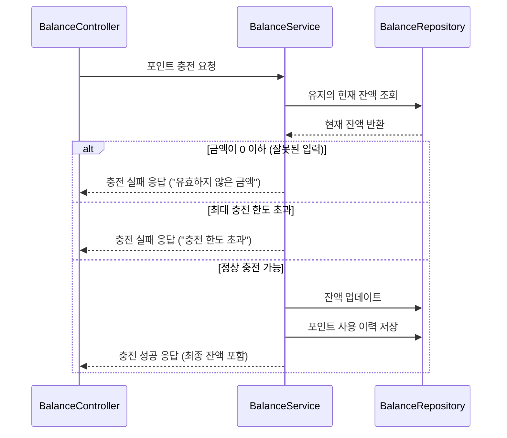

```mermaid
---
config:
  theme: default
---
sequenceDiagram
    %% 포인트 충전 시나리오 (조건 분기 중심 구조)
    participant BalanceController
    participant BalanceService
    participant BalanceRepository

    %% 1. 충전 요청
    BalanceController ->> BalanceService: 포인트 충전 요청

    %% 2. 현재 잔액 조회
    BalanceService ->> BalanceRepository: 유저의 현재 잔액 조회
    BalanceRepository -->> BalanceService: 현재 잔액 반환

    %% 3. 유효성 조건 분기
    alt 금액이 0 이하 (잘못된 입력)
        BalanceService -->> BalanceController: 충전 실패 응답 ("유효하지 않은 금액")
    else 최대 충전 한도 초과
        BalanceService -->> BalanceController: 충전 실패 응답 ("충전 한도 초과")
    else 정상 충전 가능
        %% 4. 충전 처리
        BalanceService ->> BalanceRepository: 잔액 업데이트
        BalanceService ->> BalanceRepository: 포인트 사용 이력 저장
        BalanceService -->> BalanceController: 충전 성공 응답 (최종 잔액 포함)
    end
```