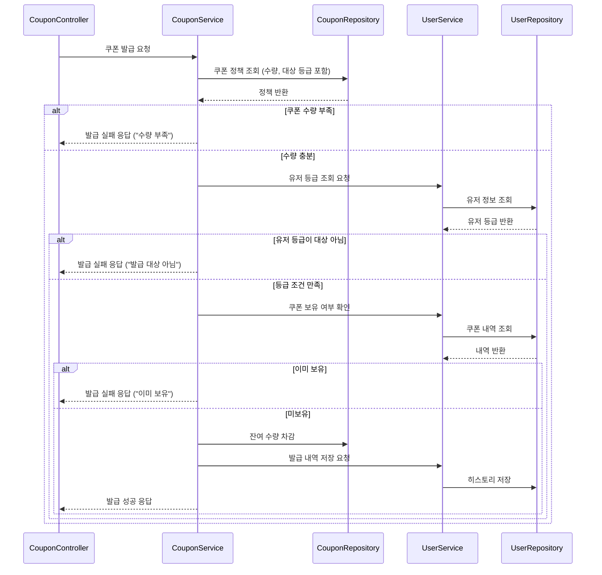

```mermaid
---
config:
  theme: default
---
sequenceDiagram
  participant CouponController as CouponController
  participant CouponService as CouponService
  participant CouponRepository as CouponRepository
  participant UserService as UserService
  participant UserRepository as UserRepository
  CouponController ->> CouponService: 쿠폰 발급 요청
  CouponService ->> CouponRepository: 쿠폰 정책 조회 (수량, 대상 등급 포함)
  CouponRepository -->> CouponService: 정책 반환
  alt 쿠폰 수량 부족
    CouponService -->> CouponController: 발급 실패 응답 ("수량 부족")
  else 수량 충분
    CouponService ->> UserService: 유저 등급 조회 요청
    UserService ->> UserRepository: 유저 정보 조회
    UserRepository -->> UserService: 유저 등급 반환
    alt 유저 등급이 대상 아님
      CouponService -->> CouponController: 발급 실패 응답 ("발급 대상 아님")
    else 등급 조건 만족
      CouponService ->> UserService: 쿠폰 보유 여부 확인
      UserService ->> UserRepository: 쿠폰 내역 조회
      UserRepository -->> UserService: 내역 반환
      alt 이미 보유
        CouponService -->> CouponController: 발급 실패 응답 ("이미 보유")
      else 미보유
        CouponService ->> CouponRepository: 잔여 수량 차감
        CouponService ->> UserService: 발급 내역 저장 요청
        UserService ->> UserRepository: 히스토리 저장
        CouponService -->> CouponController: 발급 성공 응답
      end
    end
  end

```