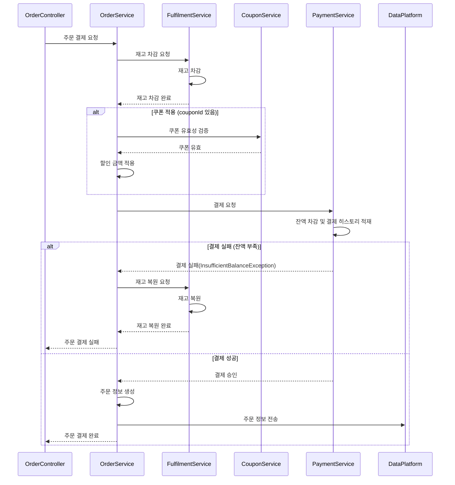

```mermaid
---
config:
  theme: default
---
sequenceDiagram
  participant OrderController as OrderController
  participant OrderService as OrderService
  participant FulfilmentService as FulfilmentService
%%   participant ProductService
  participant CouponService
  participant PaymentService as PaymentService
  participant DataPlatform as DataPlatform

  OrderController ->> OrderService: 주문 결제 요청
  OrderService ->> FulfilmentService: 재고 차감 요청
  FulfilmentService ->> FulfilmentService: 재고 차감
  FulfilmentService -->> OrderService: 재고 차감 완료

  alt 쿠폰 적용 (couponId 있음)
    OrderService ->> CouponService: 쿠폰 유효성 검증
    CouponService -->> OrderService: 쿠폰 유효
    OrderService ->> OrderService: 할인 금액 적용
  end

  OrderService ->> PaymentService: 결제 요청
  PaymentService ->> PaymentService: 잔액 차감 및 결제 히스토리 적재

  alt 결제 실패 (잔액 부족)
    PaymentService -->> OrderService: 결제 실패(InsufficientBalanceException)
    OrderService ->> FulfilmentService: 재고 복원 요청
    FulfilmentService ->> FulfilmentService: 재고 복원
    FulfilmentService -->> OrderService: 재고 복원 완료
    OrderService -->> OrderController: 주문 결제 실패
  else 결제 성공
    PaymentService -->> OrderService: 결제 승인
    OrderService ->> OrderService: 주문 정보 생성
    OrderService ->> DataPlatform: 주문 정보 전송
    OrderService -->> OrderController: 주문 결제 완료
  end

```