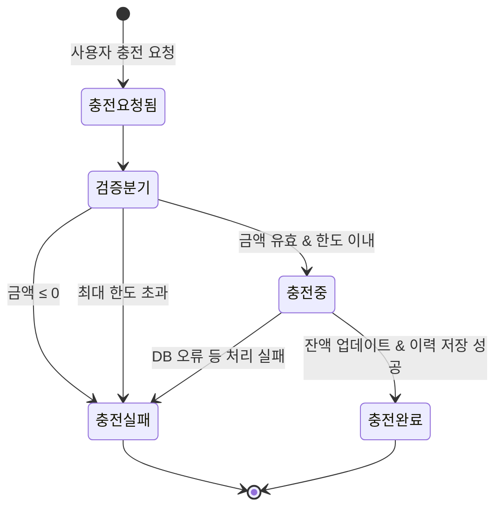

```mermaid
---
config:
  theme: default
---
stateDiagram-v2
    [*] --> 충전요청됨 : 사용자 충전 요청
    충전요청됨 --> 검증분기

    state 검증분기 <<choice>>

    검증분기 --> 충전실패 : 금액 ≤ 0
    검증분기 --> 충전실패 : 최대 한도 초과
    검증분기 --> 충전중 : 금액 유효 & 한도 이내

    충전중 --> 충전실패 : DB 오류 등 처리 실패
    충전중 --> 충전완료 : 잔액 업데이트 & 이력 저장 성공
    
    충전완료 --> [*]
    충전실패 --> [*]
```