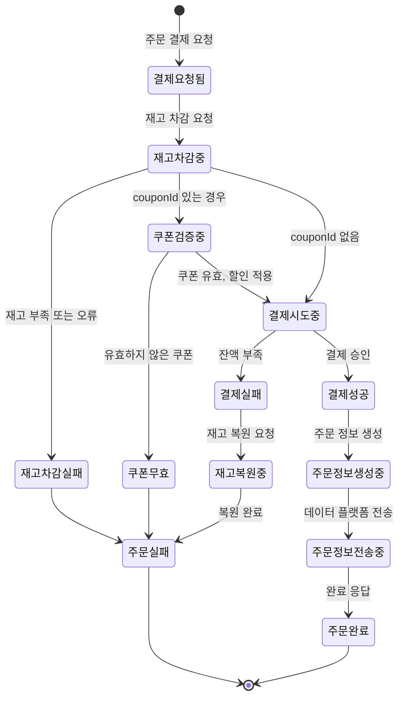

```mermaid
---
config:
  theme: default
---
stateDiagram-v2
    [*] --> 결제요청됨 : 주문 결제 요청
    결제요청됨 --> 재고차감중 : 재고 차감 요청
    재고차감중 --> 재고차감실패 : 재고 부족 또는 오류
    재고차감실패 --> 주문실패
    재고차감중 --> 쿠폰검증중 : couponId 있는 경우
    재고차감중 --> 결제시도중 : couponId 없음
    쿠폰검증중 --> 쿠폰무효 : 유효하지 않은 쿠폰
    쿠폰무효 --> 주문실패
    쿠폰검증중 --> 결제시도중 : 쿠폰 유효, 할인 적용
    결제시도중 --> 결제실패 : 잔액 부족
    결제실패 --> 재고복원중 : 재고 복원 요청
    재고복원중 --> 주문실패 : 복원 완료
    결제시도중 --> 결제성공 : 결제 승인
    결제성공 --> 주문정보생성중 : 주문 정보 생성
    주문정보생성중 --> 주문정보전송중 : 데이터 플랫폼 전송
    주문정보전송중 --> 주문완료 : 완료 응답
    주문완료 --> [*]
    주문실패 --> [*]

```